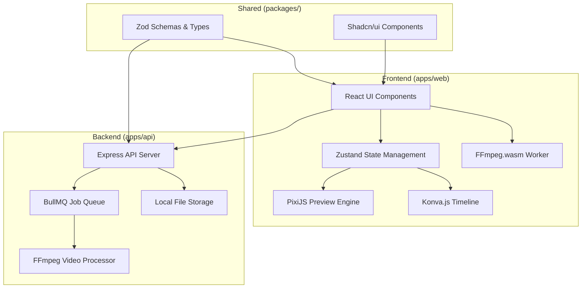

# Design Document

## Overview

Aether Editor is architected as a modern web application using a Turborepo monorepo structure with React/TypeScript frontend and Node.js/Express backend. The design emphasizes performance, type safety, and scalability through strategic technology choices including PixiJS for high-performance rendering, Konva.js for interactive timeline manipulation, and FFmpeg for professional video processing.

## Architecture

### High-Level System Architecture



### Technology Stack

**Monorepo Structure:** Turborepo for efficient build orchestration and dependency management

**Frontend Stack:**
- React 18 with TypeScript for component-based UI
- Vite for fast development and optimized builds
- Zustand for lightweight, performant state management
- Tailwind CSS for utility-first styling
- Shadcn/ui for consistent, accessible component library

**Rendering Engines:**
- PixiJS for high-performance preview window rendering
- Konva.js (react-konva) for interactive timeline manipulation
- FFmpeg.wasm for client-side media processing

**Backend Stack:**
- Node.js with TypeScript and Express.js for API server
- BullMQ with Redis for reliable job queue management
- FFmpeg for server-side video processing and export

**Shared Libraries:**
- Zod for runtime type validation and schema definition
- IndexedDB (via idb) for client-side project persistence

## Components and Interfaces

### Core Data Schema

The application centers around a comprehensive Zod schema that defines the project structure:

```typescript
// Core schemas building up to complete project
const ProjectSettingsSchema = z.object({
  name: z.string(),
  resolution: z.enum(['1080p', '4K']),
  fps: z.number().default(30),
  duration: z.number()
});

const AssetSchema = z.object({
  assetId: z.string(),
  fileName: z.string(),
  type: z.enum(['image', 'video', 'audio']),
  sourceUrl: z.string().optional(),
  thumbnailUrl: z.string().optional(),
  duration: z.number().optional()
});

const AnimationSchema = z.object({
  type: z.enum(['ken_burns']),
  startRect: z.object({
    x: z.number(),
    y: z.number(),
    scale: z.number()
  }),
  endRect: z.object({
    x: z.number(),
    y: z.number(),
    scale: z.number()
  })
});

const TransitionSchema = z.object({
  type: z.enum(['cross_dissolve']),
  duration: z.number()
});

const ClipSchema = z.object({
  clipId: z.string(),
  assetId: z.string(),
  startTime: z.number(),
  duration: z.number(),
  volume: z.number().default(1),
  animation: AnimationSchema.optional(),
  transition: TransitionSchema.optional(),
  textOverlays: z.array(z.object({
    text: z.string(),
    startTime: z.number(),
    duration: z.number(),
    position: z.object({ x: z.number(), y: z.number() })
  })).default([])
});

const AetherProjectSchema = z.object({
  projectSettings: ProjectSettingsSchema,
  assetLibrary: z.array(AssetSchema),
  timeline: z.object({
    videoTracks: z.array(z.array(ClipSchema)),
    audioTracks: z.array(z.array(ClipSchema))
  }),
  selectedClipId: z.string().nullable().default(null),
  currentTime: z.number().default(0),
  isPlaying: z.boolean().default(false),
  timelineScale: z.number().default(50)
});
```

### Frontend Component Architecture

**Main Application Layout (App.tsx):**
- Four-panel responsive layout using CSS Grid
- Global state subscription and keyboard shortcut handling
- Playback engine coordination

**Timeline Component (Timeline.tsx):**
- Konva.js Stage with draggable, zoomable interface
- Clip rendering with visual feedback for selection and trimming
- Drag-and-drop support for asset placement
- Snapping guides for precision editing

**Preview Window (PreviewWindow.tsx):**
- PixiJS Application with ticker-based rendering loop
- Dynamic content switching based on playhead position
- Animation interpolation for Ken Burns effects
- Transition rendering with alpha blending

**Asset Library (AssetLibrary.tsx):**
- Grid layout of asset cards with thumbnails
- File upload with drag-and-drop support
- Placeholder asset management for AI workflow
- Integration with FFmpeg.wasm for thumbnail generation

**Property Inspector (PropertyInspector.tsx):**
- Context-aware property editing based on selection
- Real-time validation and state updates
- Specialized controls for different clip types

### State Management Design

**Zustand Store Structure:**
```typescript
interface AetherEditorState extends AetherProjectType {
  // Actions
  addAsset: (asset: AssetType) => void;
  updateAsset: (assetId: string, updates: Partial<AssetType>) => void;
  addClipToTimeline: (asset: AssetType, startTime: number) => void;
  updateClipProperties: (clipId: string, updates: Partial<ClipType>) => void;
  setSelectedClipId: (id: string | null) => void;
  setCurrentTime: (time: number) => void;
  setPlaying: (playing: boolean) => void;
  setTimelineScale: (scale: number) => void;
  splitClip: (clipId: string, time: number) => void;
  loadProject: (project: AetherProjectType) => void;
}
```

**Temporal Middleware Integration:**
- Automatic undo/redo history tracking
- Selective state persistence to avoid performance issues
- UI controls with dynamic enable/disable based on history

### Backend API Design

**Core Endpoints:**
- `POST /api/upload` - File upload with unique ID generation
- `POST /api/render` - Project validation and render job queuing
- `GET /api/render/status/:jobId` - Job progress and status polling
- `GET /uploads/:filename` - Static asset serving

**Job Queue Architecture:**
```typescript
interface RenderJob {
  projectData: AetherProjectType;
  exportSettings: {
    resolution: '1080p' | '4K';
    format: 'mp4' | 'mov';
  };
  jobId: string;
}
```

## Data Models

### Project Persistence Model

**IndexedDB Schema:**
- Database: `aether-editor`
- Object Store: `projects`
- Key Path: `projectId`
- Indexes: `lastModified`, `projectName`

**Auto-save Strategy:**
- Debounced saves (500ms delay) on state changes
- Immediate saves on explicit user action
- Restoration on application startup

### Asset Management Model

**File Storage Strategy:**
- Frontend: File objects in memory during processing
- Backend: Physical files in `uploads/` directory with UUID naming
- Database: Asset metadata with file references

**Thumbnail Generation Pipeline:**
1. File upload to backend API
2. Unique filename generation and storage
3. Return public URL to frontend
4. Frontend FFmpeg.wasm processing for thumbnails/filmstrips
5. State update with complete asset data

## Error Handling

### Frontend Error Boundaries

**Component-Level Error Handling:**
- React Error Boundaries around major components
- Graceful degradation for rendering failures
- User-friendly error messages with recovery options

**State Validation:**
- Zod schema validation at state boundaries
- Runtime type checking for external data
- Fallback to default states on validation failures

**Media Processing Errors:**
- FFmpeg.wasm error capture and user notification
- Retry mechanisms for failed thumbnail generation
- Placeholder content for processing failures

### Backend Error Handling

**API Error Responses:**
- Consistent error format with status codes
- Detailed validation errors for malformed requests
- Proper HTTP status codes for different error types

**Job Queue Error Management:**
- Automatic retry with exponential backoff
- Dead letter queue for failed jobs
- Comprehensive logging for debugging

**FFmpeg Processing Errors:**
- Command validation before execution
- Process monitoring and timeout handling
- Detailed error reporting to job status endpoint

## Testing Strategy

### Frontend Testing Approach

**Unit Testing:**
- Jest and React Testing Library for component testing
- Zustand store testing with mock state scenarios
- Utility function testing for calculations and validations

**Integration Testing:**
- Component interaction testing
- State management flow testing
- API integration testing with mock backends

**Visual Testing:**
- Storybook for component documentation and visual regression
- Canvas rendering testing for PixiJS and Konva components
- Cross-browser compatibility testing

### Backend Testing Approach

**API Testing:**
- Supertest for endpoint testing
- Schema validation testing
- File upload and serving testing

**Job Queue Testing:**
- BullMQ job processing testing
- Redis integration testing
- FFmpeg command generation testing

**End-to-End Testing:**
- Complete render pipeline testing
- File persistence and retrieval testing
- Error scenario testing

### Performance Testing

**Frontend Performance:**
- Timeline rendering performance with large projects
- Memory usage monitoring for long editing sessions
- Canvas rendering frame rate testing

**Backend Performance:**
- Concurrent job processing testing
- Large file handling testing
- Memory usage during video processing

## Security Considerations

### File Upload Security

**File Validation:**
- MIME type verification
- File size limits
- Malicious file detection

**Storage Security:**
- Sandboxed upload directory
- Unique filename generation to prevent conflicts
- Regular cleanup of temporary files

### API Security

**Input Validation:**
- Comprehensive request validation with Zod
- Rate limiting for upload endpoints
- CORS configuration for frontend access

**Process Security:**
- FFmpeg command sanitization
- Resource limits for video processing
- Isolated worker processes

## Scalability Considerations

### Frontend Scalability

**Performance Optimization:**
- Virtual scrolling for large timelines
- Efficient re-rendering with React.memo
- Canvas optimization for smooth animations

**Memory Management:**
- Asset cleanup for unused media
- Efficient state updates to prevent memory leaks
- Garbage collection optimization for long sessions

### Backend Scalability

**Job Processing:**
- Horizontal scaling with multiple worker processes
- Redis clustering for high availability
- Load balancing for API endpoints

**Storage Optimization:**
- Efficient file organization
- Automatic cleanup of old projects
- Compression for stored assets

This design provides a robust foundation for implementing the Aether Editor with professional-grade performance, reliability, and user experience.