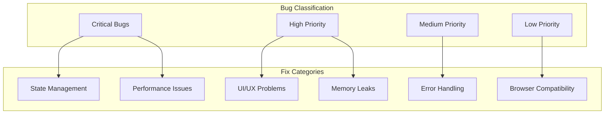

# Design Document

## Overview

This design document outlines a systematic approach to fixing critical bugs, performance issues, and stability problems in the Aether Editor. The design focuses on transforming the application from a functional prototype into a production-ready, professional video editing tool through comprehensive bug fixes, performance optimizations, and stability improvements.

## Architecture

### Bug Classification and Priority System



### Current Issues Analysis

Based on code analysis, the following critical issues have been identified:

**State Management Issues:**
- Temporal middleware (zundo) configuration problems causing crashes
- React state update warnings and `act()` issues
- Inconsistent state synchronization between components
- Undo/redo functionality partially broken

**Performance Problems:**
- Memory leaks in canvas operations (PixiJS/Konva)
- Inefficient re-rendering in Timeline component
- Large project handling causing browser freezes
- Thumbnail generation blocking main thread

**UI/UX Bugs:**
- Unused imports and variables causing TypeScript warnings
- Responsive layout breaking on certain screen sizes
- Modal focus management issues
- Accessibility problems with keyboard navigation

**Error Handling Gaps:**
- Missing error boundaries in critical components
- Poor network error handling
- Insufficient validation in API endpoints
- Silent failures in asset processing

## Components and Interfaces

### 1. Bug Tracking and Monitoring System

**Enhanced Error Boundary System:**
```typescript
interface ErrorBoundaryState {
  hasError: boolean;
  error: Error | null;
  errorInfo: ErrorInfo | null;
  errorId: string;
  timestamp: Date;
}

interface ErrorReportingService {
  reportError: (error: Error, context: ErrorContext) => void;
  getErrorHistory: () => ErrorReport[];
  clearErrors: () => void;
}
```

**Performance Monitoring Enhancement:**
```typescript
interface PerformanceMetrics {
  memoryUsage: number;
  frameRate: number;
  renderTime: number;
  componentUpdateCount: number;
  errorCount: number;
  warningCount: number;
}

interface PerformanceMonitor {
  startMonitoring: () => void;
  stopMonitoring: () => void;
  getMetrics: () => PerformanceMetrics;
  setThresholds: (thresholds: PerformanceThresholds) => void;
  onThresholdExceeded: (callback: (metric: string, value: number) => void) => void;
}
```

### 2. State Management Fixes

**Temporal Middleware Configuration:**
```typescript
// Fixed zundo configuration
const useAetherStore = create<AetherEditorState>()(
  subscribeWithSelector(
    temporal(
      (set, get) => ({
        // Store implementation
      }),
      {
        limit: 50,
        partialize: (state) => ({
          projectSettings: state.projectSettings,
          assetLibrary: state.assetLibrary,
          timeline: state.timeline
        }),
        equality: (pastState, currentState) => {
          return JSON.stringify(pastState) === JSON.stringify(currentState);
        },
        handleSet: (handleSet) => (partial, replace) => {
          // Wrap state updates to prevent React warnings
          handleSet(partial, replace);
        }
      }
    )
  )
);
```

**State Synchronization Manager:**
```typescript
interface StateSyncManager {
  registerComponent: (componentId: string, updateCallback: () => void) => void;
  unregisterComponent: (componentId: string) => void;
  notifyStateChange: (stateKey: string, newValue: any) => void;
  batchUpdates: (updates: StateUpdate[]) => void;
}
```

### 3. Performance Optimization System

**Memory Management Service:**
```typescript
interface MemoryManager {
  trackComponent: (componentId: string, cleanup: () => void) => void;
  untrackComponent: (componentId: string) => void;
  forceCleanup: () => void;
  getMemoryUsage: () => MemoryUsageReport;
  setMemoryThreshold: (threshold: number) => void;
}

interface CanvasResourceManager {
  createCanvas: (id: string, options: CanvasOptions) => HTMLCanvasElement;
  destroyCanvas: (id: string) => void;
  optimizeCanvas: (id: string) => void;
  getCanvasMetrics: () => CanvasMetrics;
}
```

**Rendering Optimization:**
```typescript
interface RenderOptimizer {
  shouldComponentUpdate: (prevProps: any, nextProps: any) => boolean;
  memoizeExpensiveOperations: <T>(fn: () => T, deps: any[]) => T;
  throttleUpdates: (updateFn: () => void, delay: number) => void;
  batchRenderUpdates: (updates: RenderUpdate[]) => void;
}
```

### 4. Enhanced Error Handling

**Comprehensive Error System:**
```typescript
interface ErrorHandler {
  handleError: (error: Error, context: ErrorContext) => void;
  recoverFromError: (errorType: ErrorType) => boolean;
  reportError: (error: Error, severity: ErrorSeverity) => void;
  getErrorSuggestions: (error: Error) => string[];
}

interface ErrorContext {
  component: string;
  action: string;
  userId?: string;
  projectId?: string;
  timestamp: Date;
  browserInfo: BrowserInfo;
  stackTrace: string;
}
```

**Network Error Handling:**
```typescript
interface NetworkErrorHandler {
  handleNetworkError: (error: NetworkError) => void;
  retryRequest: (request: RequestConfig, maxRetries: number) => Promise<any>;
  handleOfflineMode: () => void;
  queueOfflineActions: (actions: OfflineAction[]) => void;
}
```

### 5. UI/UX Consistency Framework

**Component Validation System:**
```typescript
interface ComponentValidator {
  validateProps: (component: string, props: any) => ValidationResult;
  checkAccessibility: (element: HTMLElement) => AccessibilityReport;
  validateResponsive: (component: string) => ResponsiveReport;
  checkPerformance: (component: string) => PerformanceReport;
}

interface UIConsistencyChecker {
  checkColorContrast: (element: HTMLElement) => ContrastReport;
  validateSpacing: (element: HTMLElement) => SpacingReport;
  checkTypography: (element: HTMLElement) => TypographyReport;
  validateInteractions: (element: HTMLElement) => InteractionReport;
}
```

## Data Models

### Error Tracking Schema

```typescript
interface ErrorReport {
  id: string;
  timestamp: Date;
  error: {
    message: string;
    stack: string;
    name: string;
  };
  context: ErrorContext;
  severity: 'low' | 'medium' | 'high' | 'critical';
  resolved: boolean;
  resolution?: string;
  occurrenceCount: number;
}

interface PerformanceReport {
  id: string;
  timestamp: Date;
  metrics: PerformanceMetrics;
  issues: PerformanceIssue[];
  recommendations: string[];
  projectComplexity: 'simple' | 'medium' | 'complex';
}
```

### Bug Fix Tracking

```typescript
interface BugFix {
  id: string;
  title: string;
  description: string;
  severity: BugSeverity;
  status: 'identified' | 'in-progress' | 'testing' | 'resolved';
  affectedComponents: string[];
  reproductionSteps: string[];
  solution: string;
  testCases: TestCase[];
  regressionTests: string[];
}
```

## Error Handling

### Comprehensive Error Boundary Strategy

**Component-Level Error Boundaries:**
```typescript
// Enhanced error boundary for each major component
class ComponentErrorBoundary extends React.Component<Props, State> {
  constructor(props: Props) {
    super(props);
    this.state = { hasError: false, error: null, errorInfo: null };
  }

  static getDerivedStateFromError(error: Error): State {
    return { hasError: true, error, errorInfo: null };
  }

  componentDidCatch(error: Error, errorInfo: ErrorInfo) {
    // Log error with context
    errorReportingService.reportError(error, {
      component: this.props.componentName,
      errorInfo,
      timestamp: new Date(),
      userAgent: navigator.userAgent
    });

    // Attempt recovery
    this.attemptRecovery(error);
  }

  attemptRecovery(error: Error) {
    // Implement component-specific recovery strategies
    switch (this.props.componentName) {
      case 'Timeline':
        this.recoverTimeline();
        break;
      case 'PreviewWindow':
        this.recoverPreview();
        break;
      default:
        this.genericRecovery();
    }
  }
}
```

**Global Error Handler:**
```typescript
class GlobalErrorHandler {
  private static instance: GlobalErrorHandler;
  private errorQueue: ErrorReport[] = [];
  private maxErrors = 100;

  static getInstance(): GlobalErrorHandler {
    if (!GlobalErrorHandler.instance) {
      GlobalErrorHandler.instance = new GlobalErrorHandler();
    }
    return GlobalErrorHandler.instance;
  }

  handleError(error: Error, context: ErrorContext): void {
    const errorReport: ErrorReport = {
      id: generateId(),
      timestamp: new Date(),
      error: {
        message: error.message,
        stack: error.stack || '',
        name: error.name
      },
      context,
      severity: this.determineSeverity(error, context),
      resolved: false,
      occurrenceCount: 1
    };

    this.addToQueue(errorReport);
    this.processError(errorReport);
  }

  private determineSeverity(error: Error, context: ErrorContext): ErrorSeverity {
    // Critical: App crashes, data loss
    if (error.name === 'ChunkLoadError' || 
        error.message.includes('Cannot read property') ||
        context.component === 'App') {
      return 'critical';
    }

    // High: Feature broken, user blocked
    if (context.component === 'Timeline' || 
        context.component === 'PreviewWindow' ||
        error.message.includes('Network Error')) {
      return 'high';
    }

    // Medium: Degraded experience
    if (context.component === 'AssetLibrary' ||
        context.component === 'PropertyInspector') {
      return 'medium';
    }

    return 'low';
  }
}
```

## Testing Strategy

### Comprehensive Bug Testing Framework

**Automated Bug Detection:**
```typescript
interface BugDetector {
  detectMemoryLeaks: () => MemoryLeakReport[];
  detectPerformanceIssues: () => PerformanceIssue[];
  detectStateInconsistencies: () => StateIssue[];
  detectUIProblems: () => UIIssue[];
  detectAccessibilityIssues: () => AccessibilityIssue[];
}

interface RegressionTestSuite {
  runAllTests: () => Promise<TestResults>;
  runCriticalTests: () => Promise<TestResults>;
  runPerformanceTests: () => Promise<PerformanceTestResults>;
  runAccessibilityTests: () => Promise<AccessibilityTestResults>;
}
```

**Integration Testing Strategy:**
```typescript
interface IntegrationTestFramework {
  testCompleteWorkflow: () => Promise<WorkflowTestResult>;
  testErrorRecovery: () => Promise<RecoveryTestResult>;
  testPerformanceUnderLoad: () => Promise<LoadTestResult>;
  testBrowserCompatibility: () => Promise<CompatibilityTestResult>;
}
```

### Performance Testing

**Load Testing Framework:**
```typescript
interface LoadTester {
  testLargeProjects: (projectSize: ProjectSize) => Promise<LoadTestResult>;
  testMemoryUsage: (duration: number) => Promise<MemoryTestResult>;
  testConcurrentOperations: (operationCount: number) => Promise<ConcurrencyTestResult>;
  testAssetProcessing: (assetCount: number, assetSize: number) => Promise<ProcessingTestResult>;
}
```

## Security Considerations

### Input Validation and Sanitization

**Enhanced Validation System:**
```typescript
interface ValidationService {
  validateProjectData: (data: any) => ValidationResult;
  sanitizeUserInput: (input: string) => string;
  validateFileUploads: (file: File) => FileValidationResult;
  checkForMaliciousContent: (content: any) => SecurityCheckResult;
}
```

### Error Information Security

**Secure Error Reporting:**
```typescript
interface SecureErrorReporter {
  sanitizeErrorMessage: (error: Error) => string;
  removePersonalInfo: (errorContext: ErrorContext) => ErrorContext;
  encryptSensitiveData: (data: any) => string;
  validateErrorReportPermissions: (userId: string) => boolean;
}
```

## Scalability Considerations

### Performance Optimization Strategy

**Lazy Loading and Code Splitting:**
```typescript
// Implement lazy loading for heavy components
const Timeline = React.lazy(() => import('./components/Timeline'));
const PreviewWindow = React.lazy(() => import('./components/PreviewWindow'));
const AssetLibrary = React.lazy(() => import('./components/AssetLibrary'));

// Performance-aware component loading
interface ComponentLoader {
  loadComponent: (componentName: string) => Promise<React.ComponentType>;
  preloadComponents: (componentNames: string[]) => Promise<void>;
  unloadComponent: (componentName: string) => void;
  getLoadedComponents: () => string[];
}
```

**Resource Management:**
```typescript
interface ResourceManager {
  allocateResources: (component: string, resources: ResourceRequirement) => void;
  deallocateResources: (component: string) => void;
  optimizeResourceUsage: () => void;
  getResourceUsage: () => ResourceUsageReport;
  setResourceLimits: (limits: ResourceLimits) => void;
}
```

### Memory Optimization

**Advanced Memory Management:**
```typescript
interface AdvancedMemoryManager {
  implementWeakReferences: () => void;
  setupGarbageCollectionHints: () => void;
  optimizeObjectPooling: () => void;
  implementLazyInitialization: () => void;
  setupMemoryPressureHandling: () => void;
}
```

This design provides a comprehensive framework for systematically addressing all identified bugs, performance issues, and stability problems in the Aether Editor, transforming it into a production-ready application.